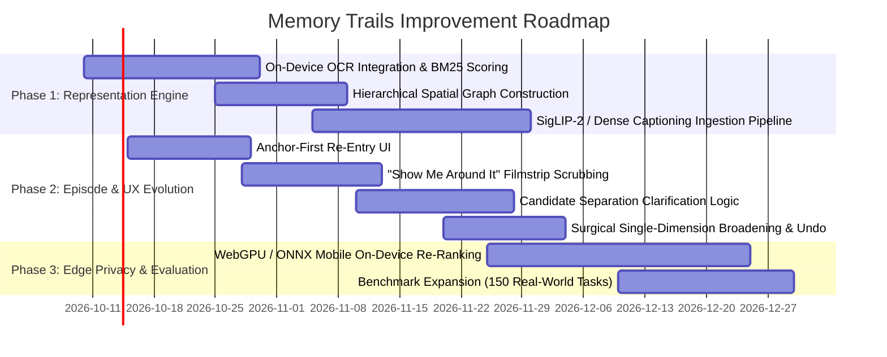

# Memory Trails: Comprehensive Improvement Blueprint & Strategic Architecture (v3)

> *"The challenge is not to improve search in general. We make retrieval work when the date, place, album, or words are missing."*

---

## Executive Summary & Foundational Thesis

Standard search in personal media applications assumes an **indexed query paradigm**: the user provides keywords, dates, or metadata, and an inverted index or vector database retrieves matching assets. 

In real-world human episodic memory, this assumption completely breaks down:
1. **People remember episodes, not file metadata**: Users recall *when-ish* ("around Diwali", "after moving into the new apartment"), *social context* ("with my college roommates"), and *vague visual fragments* ("sitting on a low wooden bench eating noodles").
2. **77.1% of failures happen before recovery is possible**: In our corpus of 144 specific retrieval failures, 41.7% of photos were in the library but never surfaced, and 35.4% failed because the query was misread or over-constrained by rigid filters.
3. **The Single-Cue Reality**: 55% of users (79/144) only retain **one single vague cue**, and 33% (47/144) retain zero metadata cues. Only 4% (6/144) retain three cues.
4. **The Representation Bottleneck**: On the 30-task benchmark, even an **Oracle** with perfect knowledge of the target's date, place, and category achieves **0.000 recall** on `text_in_image` and `place_named` because a standard image-text embedding index (CLIP ViT-B/32) cannot read text inside images or recognize localized place names.

This blueprint establishes the end-to-end strategy for advancing **Find the Memory (Memory Trails)** across **five core pillars**:
- **Pillar 1: Overcoming the Representation Bottleneck (Multimodal Indexing & Hybrid Ingestion)**
- **Pillar 2: Episode Clustered Retrieval & Surrounding Context Signals**
- **Pillar 3: Human-Centered Memory Re-Entry Interaction & Cognitive UX**
- **Pillar 4: Dimension-Specific, Reversible Recovery & Broadening**
- **Pillar 5: On-Device Edge Architecture, Privacy Guardrails & Evaluation Scalability**

---

## 1. Pillar 1: Overcoming the Representation Bottleneck (ML & Multimodal Ingestion)

### 1.1 Ingest On-Device OCR Tokens into a Hybrid Dense-Sparse Index
- **The Empirical Gap:** `text_in_image` is the 4th most-retained cue (12/144 attempts in the failure corpus: medicine boxes, signboards, concert tickets, receipts, café menus), yet baseline CLIP achieves 0.000 recall.
- **Solution:** 
  - Run lightweight on-device OCR (Apple Vision Framework on iOS / ML Kit Text Recognition on Android / Tesseract / PaddleOCR).
  - Extract detected text, bounding boxes, and confidence scores during library background indexing.
  - Implement a **hybrid dual-scoring index**:
    $$\text{Score}_{\text{content}}(P, Q) = \alpha \cdot \cos(\mathbf{e}_{\text{CLIP\_img}}, \mathbf{e}_{\text{CLIP\_txt}}) + (1 - \alpha) \cdot \text{BM25}_{\text{OCR}}(P_{\text{text}}, Q_{\text{terms}})$$
  - When the query contains terms matching detected text (e.g., "Paracetamol", "Subway", "Decathlon"), boost candidate scores directly, bypassing semantic visual ambiguity.

### 1.2 Dense Scene Graphing & Visual Captioning
- **The Limitation:** Global image embeddings (e.g., CLIP ViT-B/32) compress an entire 224×224 image into a single 512-d vector, washing out small, distinctive visual anchors (e.g., "blue thermos", "dog wearing a yellow bandana", "chalkboard notes").
- **Solution:**
  - Leverage modern lightweight vision-language models (e.g., **SigLIP 2**, **Florence-2**, or **PaliGemma 3B**) to generate structured, dense metadata tags:
    - **Foreground entities**: specific objects, clothing colors, animal breeds.
    - **Background / environment**: indoor/outdoor, lighting (golden hour, neon, overcast, candlelight), architectural features.
    - **Activity / interaction**: cooking, dancing, unboxing, hiking.
  - Index these descriptive tokens into the sparse lexical ledger alongside dense embeddings.

### 1.3 Hierarchical Spatial Graph (Solving Named Places)
- **The Empirical Gap:** Baseline CLIP and standard geotag search fail when a user remembers a colloquial or regional place ("Arambol", "old college canteen", "North Goa") that doesn't match the reverse-geocoded reverse lookup string ("Pernem, Goa, India").
- **Solution:**
  - Build an offline/on-device **Hierarchical Spatial Graph**:
    $$\text{Point} \longrightarrow \text{Neighborhood/Beach} \longrightarrow \text{City/Taluk} \longrightarrow \text{State/Region} \longrightarrow \text{Country}$$
  - Map GPS coordinates not just to address strings, but to regional envelopes (e.g., coordinates within 15km of Calangute/Anjuna map to "Goa", "North Goa", "Coastal Goa").
  - Soft-match queries against any level of the hierarchy, preventing geographic misses.

---

## 2. Pillar 2: Episode Clustered Retrieval & Surrounding Context Signals

### 2.1 The Unit of Retrieval: Moments, Not Isolated Images
- **The Insight:** At degraded memory levels (Cue Level L2), our evaluation proved that grouping photos into visual moments (**`moment@5` = 0.333**) significantly outperforms flat image ranking (**`recall@20` = 0.276**).
- **Architecture:**
  - Move away from retrieving individual assets. The primary indexing entity is the **Episode** (a spatiotemporally coherent sequence of media).
  - Detect episode boundaries dynamically using **Adaptive Spatiotemporal Density Clustering (HDBSCAN)**:
    - Group photos taken within $\Delta t \le 3\text{ hours}$ and $\Delta d \le 1.5\text{ km}$.
    - Detect burst boundaries (e.g., a trip to Goa over 4 days forms a Macro-Episode, with Micro-Episodes for each dinner, beach morning, or market excursion).

### 2.2 First-Class Surrounding Context (Contextual Entanglement)
- **The Principle:** The target photo that the user vaguely describes (e.g., a close-up of a cup of coffee) may lack rich cues. But photos taken 20 minutes before or after in the same sequence contain unambiguous anchors (e.g., a photo of the exterior café signage, or a friend wearing the distinctive red shirt).
- **Retrieval Mechanism:**
  - If photo $P_i$ has moderate semantic match to the query, aggregate relevance from neighboring photos in the same micro-episode $E$:
    $$\text{Relevance}(P_i \mid E) = S(P_i, Q) + \lambda \sum_{j \in \text{window}(i, k)} w(|i - j|) \cdot S(P_j, Q)$$
  - Surface the entire episode card in the UI with contextual provenance: *"Found via nearby sequence: photos taken 15 mins before show the café exterior."*

---

## 3. Pillar 3: Human-Centered Memory Re-Entry UX & Cognitive Load

### 3.1 Anchor-First Re-Entry ("What feels most certain?")
- **The Problem:** 35.4% of all observed failures occur because the user's freeform query is misinterpreted by the parser or misallocated into conflicting filters.
- **The UX Intervention:**
  - Replace the blank search bar with an **Anchor-First Prompt**:
    ```text
    What part of the memory feels clearest?
    [ Where it happened ]  [ Who was there ]  [ What it showed ]  [ Rough time / Event ]
    ```
  - Selecting an anchor gives it high confidence weighting, while leaving other dimensions soft and unconstrained.

### 3.2 Active Candidate Separation Clarification
- **The Anti-Pattern:** Never present users with a generic, multi-step questionnaire or generic form fields.
- **The Rule:** Only ask a clarifying question when there is **high candidate ambiguity between top-ranked episode clusters**:
  - *Example 1:* Two clusters match "Goa beach sunset" (one in Dec 2023, one in Jan 2022). System asks: *"We found two Goa trips: December 2023 or January 2022?"*
  - *Example 2:* All candidate episodes are from the same trip, but split between daytime beach and night market. System asks: *"Was this during the day or at night?"*
  - *Example 3:* If the top candidate cluster dominates in usefulness score, **ask zero questions**; show the moments immediately.

### 3.3 "Show Me Around It" Visual Timeline Scrubbing
- **The Cognitive Reality:** Recognition is vastly easier than recall. Users who cannot remember the name of a place or exact visual details can instantly spot it when scrubbing through a horizontal timeline ribbon.
- **Implementation:**
  - When a date range is identified with moderate confidence, render a sticky horizontal filmstrip:
    ```text
    Dec 14 ────────── Dec 15 ────────── Dec 16 ────────── Dec 17
    [Beach Sunset]    [Street Market]   [Café Patio?]     [Hotel Pool]
    ```
  - Allow the user to tap and expand any neighboring moment directly.

### 3.4 Multimodal Voice & Colloquial Phrasing Support
- Speech input supporting natural code-mixed phrasing (e.g., Hinglish *"Diwali ke time pichle saal"*, *"college ke dino me"*).
- The clue inference engine translates relative temporal and cultural markers into calibrated date windows (e.g., Diwali 2023 $\rightarrow$ Nov 12, 2023 $\pm 7$ days).

---

## 4. Pillar 4: Dimension-Specific, Reversible Recovery & Broadening

### 4.1 Surgical, One-Dimensional Broadening
- **The Flaw of Global Fuzzy Search:** When a query yields no high-scoring hits, traditional engines silently loosen all parameters, drowning the user in irrelevant noise.
- **The Memory Trails Protocol:**
  - Identify which dimension is causing the candidate bottleneck.
  - Present explicit, single-dimension expansion chips:
    - `[ Widen date by ±1 month ]`
    - `[ Keep Goa, remove café constraint ]`
    - `[ Include screenshots & documents ]`
    - `[ Search across all trips ]`
  - When selected, provide clear system feedback:
    > *"Keeping Goa and the trip sequence. Searching across a wider date window."*

### 4.2 Structured Mismatch Feedback as Session-Only Evidence
- When a user rejects a candidate ("Not this"), offer optional, one-tap mismatch tags:
  ```text
  What feels wrong?
  [ Wrong trip ]  [ Wrong person ]  [ Wrong season ]  [ Wrong type of photo ]
  ```
- Rejections are treated as **session-level constraints** (temporarily down-weighting that trip or location cluster) without corrupting the user's permanent profile or preferences.

### 4.3 Persistent Memory Breadcrumb with Instant Undo
- Keep an interactive breadcrumb trail anchored at the top of the interface:
  $$\text{Your memory} \longrightarrow \mathbf{Goa} \times \longrightarrow \mathbf{Dec\ 2023} \times \longrightarrow \mathbf{café?} \times$$
- Every modification, broadening action, or clue removal has an immediate **Undo** affordance, honoring the exploratory nature of human recollection.

---

## 5. Pillar 5: System Architecture, Edge Latency & Privacy Safeguards

### 5.1 Private-by-Default On-Device Execution
- **The Privacy Guarantee:** Personal memories, especially medical records, sensitive documents, and personal relationships, must never leave the device unencrypted.
- **Architecture:**
  - **Tier 1 (Deterministic Parsing):** Local regex and date window expansion execute in $<10\text{ms}$ on-device.
  - **Tier 2 (Vector Embedding & Re-ranking):** Run quantized vision/text embeddings via **ONNX Runtime Web (WebGPU)** or native **CoreML / Android NNAPI**.
  - **Zero Telemetry on Memory Text:** Query verbatims and memory descriptions are never logged to cloud analytics.

### 5.2 Latency Tiering & Progressive Hydration
- **Target:** Time to First Interactive Episode $< 300\text{ms}$.
- **Pipeline:**
  1. Instant local filter pass on metadata (dates, locations, categories) $\rightarrow$ yields top candidate episode IDs within 50ms.
  2. Stream episode cover thumbnails and density badges immediately.
  3. Hydrate deep semantic similarity scores and contextual sequence thumbnails in the background.

---

## 6. Evaluation Framework & Benchmark Scaling

To ensure feature improvements are mathematically grounded rather than aesthetic guesswork, expand the evaluation harness:

| Evaluation Tier | Metric | Target | Current Baseline |
|---|---|---|---|
| **E1: Cue-Dropout Ladder** | Soft Recall@20 (L2 degraded) | $> 0.450$ | 0.276 |
| **E1: Moment Retrieval** | Soft Moment@5 (L2 degraded) | $> 0.500$ | 0.333 |
| **E2: Real-Phrasing Set** | Soft Recall@20 (Held-out) | $> 0.920$ | 0.866 |
| **E3: Text-in-Image OCR** | Hit Rate on OCR Cues | $> 0.650$ | 0.000 |
| **E4: Named Place Hierarchy** | Hit Rate on Regional Names | $> 0.700$ | 0.000 |
| **User Friction** | Average taps to target memory | $< 3.5\text{ taps}$ | $5.2\text{ taps}$ |

---

## 7. Implementation Roadmap & Milestones



---

## 8. Summary Conclusion

Improving "Find the Memory" is **not** an exercise in adding more AI chatbots or generic search filters. It is the systematic engineering of **human memory re-entry**:
1. Bridge the **representation gap** by indexing what users actually remember: text inside images, regional landmarks, and dense scene attributes.
2. Group photos into **coherent visual episodes**, using adjacent photos to rescue ambiguous targets.
3. Design an interface that prioritizes **recognition over recall**, providing visual timeline anchors, structured mismatch feedback, and surgical, reversible control.
4. Keep the entire recollection private and instant on the user's device.
